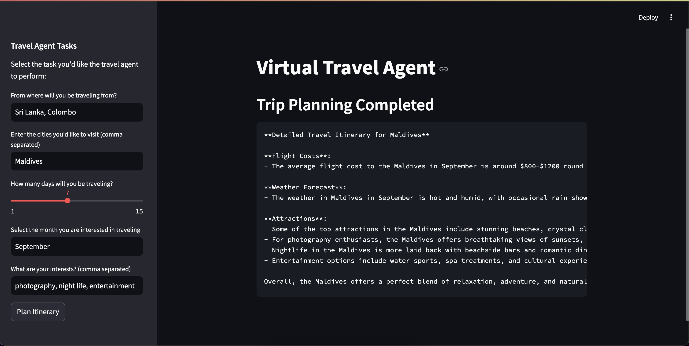

# Trip Planning Bot

Welcome to the Trip Planning Bot project! This bot utilizes Crewai and the OpenAI API to help users plan their trips by generating detailed itineraries. With this bot, you can receive comprehensive travel plans, including flight costs, weather forecasts, attractions, and more.



## Features

- **Detailed Travel Itinerary**: Generate a complete travel itinerary including flight costs, weather forecasts, and top attractions.
- **Customizable**: Tailor the itinerary to your destination and interests.
- **User-Friendly**: Easy to use and provides insightful information for planning your trip.

## Getting Started

### Prerequisites

- Python 3.8 or higher
- OpenAI API key
- Serper API key

### Installation

1. **Clone the Repository**

    ```bash
    git clone https://github.com/nuwan-dharmarathna/Virtual-Travel-Guide
    cd Virtual-Travel-Guide
    ```

2. **Set Up a Virtual Environment**

    ```bash
    python -m venv venv
    ```

3. **Activate the Virtual Environment**

    - On Windows:
    
      ```bash
      venv\Scripts\activate
      ```

    - On macOS/Linux:
    
      ```bash
      source venv/bin/activate
      ```

4. **Install the Required Packages**

    ```bash
    pip install -r requirements.txt
    ```

5. **Configure API Keys**

    Ensure you have your Crewai, Serper API, OpenAI API keys. Set them up in your environment variables or a configuration file as per the project's requirements.

6. **Run the Bot**

    ```bash
    streamlit run app.py
    ```

## References

- [Crewai Documentation](https://github.com/crewAIInc/crewAI?tab=readme-ov-file#why-crewai)
- [Serper Account](https://serper.dev/)
- [OpenAI API Documentation](https://platform.openai.com/docs)
- [YouTube](https://www.youtube.com/watch?v=sPzc6hMg7So&list=WL&index=1&t=31s)

## License

This project is licensed under the MIT License. See the [LICENSE](LICENSE) file for details.


